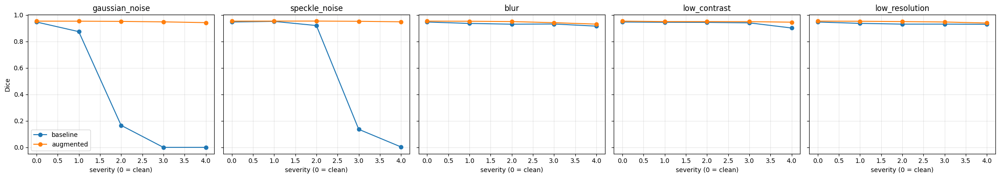
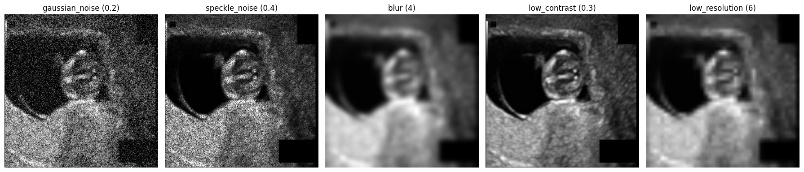
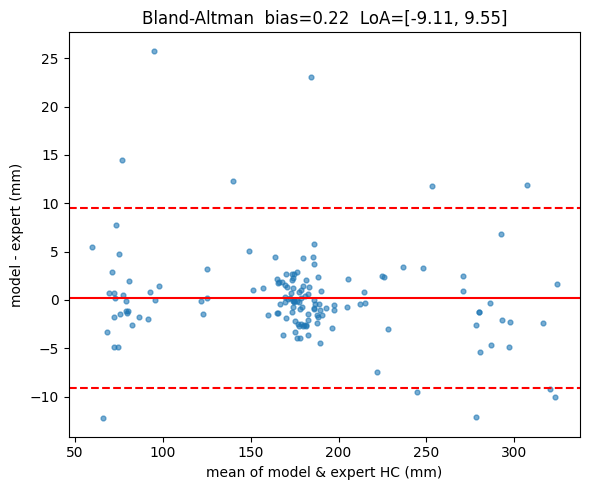
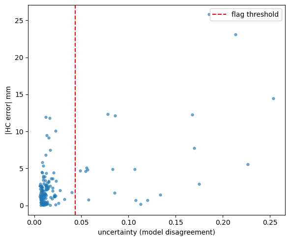
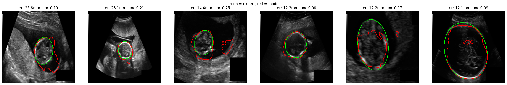

# Robust and Uncertainty-Aware Fetal Head Circumference Measurement

Automatic head circumference (HC) measurement on fetal ultrasound with a U-Net, tested on **degraded images** (simulating older machines), improved with **augmentation**, and equipped with an **ensemble uncertainty flag** for clinical review.

**Dataset:** HC18 (van den Heuvel et al., 2018), 999 annotated ultrasound images. [Zenodo](https://zenodo.org/records/1327317)
**Code:** single Google Colab notebook, [`HC18_dataset.ipynb`](HC18_dataset.ipynb) (PyTorch, OpenCV)

> **Note:** All numbers below are from my own run on a patient-level split of the HC18 training set. Image degradations are *simulated*, not real old-machine images.

---

## 1. Problem

Sonographers measure HC by hand: they place an ellipse on the ultrasound image. This is repetitive, differs between operators (inter-observer variability), and image quality differs between machines. Many published models are tested only on clean images from good machines.

**Research question:** *Does a segmentation model that works on clean images stay reliable on blurry, noisy, low-contrast images? And can it tell us when it is probably wrong?*

## 2. Method

**Pipeline:** image → U-Net segmentation → ellipse fit → HC in mm → clinician accepts or edits.

1. **Data.** 999 HC18 training images with expert head masks (the outline annotation was filled to a solid mask). Images were resized to 256×256. Split **by patient** into train / validation / test = **711 / 143 / 145** images, so images from the same examination never appear in both train and test (avoids data leakage).
2. **Model.** A U-Net (4 down/up levels, base 16 channels), trained with BCE + Dice loss, Adam (lr 1e-3), 10 epochs, batch size 16. The checkpoint with the best validation Dice was kept.
3. **Baseline.** Trained on clean images (with random flips only). Best validation Dice: 0.955.
4. **Robustness test.** Test images were degraded at 5 severity levels with: Gaussian noise, speckle noise, blur, low contrast, low resolution.
5. **Fix.** Models trained with random degradations applied to 70% of training images (data augmentation).
6. **Uncertainty.** Three augmented models (seeds 0, 1, 2; validation Dice 0.955, 0.958, 0.950) form an ensemble. Uncertainty = 1 − mean pairwise Dice between the three predicted masks (disagreement). An image is **flagged for review** if its uncertainty is above the 90th percentile of the *validation* set (threshold 0.044).
7. **Clinical measures.** HC (mm) from a fitted ellipse (Ramanujan perimeter × pixel size), MAE against expert HC, Bland-Altman analysis, and failure-case review.

## 3. Results

### 3.1 Robustness: baseline vs augmented (Dice on the test set)



Examples of the simulated degradations:



| Degradation | Moderate level | Baseline | Augmented | Strongest level | Baseline | Augmented |
|---|---|---|---|---|---|---|
| Clean | – | 0.947 | 0.954 | – | – | – |
| Gaussian noise | σ = 0.2 | **0.000** | 0.949 | σ = 0.3 | **0.000** | 0.943 |
| Speckle noise | 0.4 | **0.136** | 0.953 | 0.6 | **0.003** | 0.949 |
| Blur | σ = 4 | 0.932 | 0.942 | σ = 6 | 0.916 | 0.931 |
| Low contrast | factor 0.3 | 0.941 | 0.950 | factor 0.15 | 0.902 | 0.946 |
| Low resolution | ÷6 | 0.932 | 0.948 | ÷8 | 0.930 | 0.940 |

**Finding:** The baseline is accurate on clean images (Dice 0.947) but **collapses under noise**: with Gaussian noise of σ = 0.2 or speckle noise of 0.4 its Dice drops to about zero, meaning it no longer finds the head. Blur, low contrast and low resolution hurt it much less (Dice down by 0.02 to 0.05 at the strongest level). The model trained with degraded images stays between 0.94 and 0.95 Dice at all tested levels. The gain is huge for noise, and small (0.01 to 0.04 Dice) for blur, low contrast and low resolution.

### 3.2 Clinical accuracy of the 3-model ensemble (HC in mm)

On the clean test set the ensemble reaches **Dice 0.957** and a **mean absolute error of 2.90 mm** in HC. The Bland-Altman analysis shows a **bias of +0.22 mm** (almost no systematic over- or under-measurement) with **limits of agreement of −9.11 to +9.55 mm**. The limits are wide mainly because of a few outliers (two images with errors above 20 mm).



### 3.3 Performance on degraded images (ensemble)

| Condition | MAE (mm) | Mean uncertainty | % images flagged |
|---|---|---|---|
| Clean | 2.90 | 0.028 | 14.5 |
| Gaussian noise (0.2) | 3.49 | 0.034 | 17.2 |
| Speckle noise (0.4) | 2.91 | 0.033 | 13.8 |
| Blur (σ=4) | 4.36 | 0.039 | 18.6 |
| Low contrast (0.3) | 5.14 | 0.036 | 16.6 |
| Low resolution (÷6) | 4.09 | 0.034 | 16.6 |

- The augmented ensemble was almost unaffected by **speckle noise** (2.90 → 2.91 mm).
- **Low contrast** (+2.2 mm), **blur** (+1.5 mm) and **low resolution** (+1.2 mm) caused the largest increase in HC error, even though Dice changed only slightly. A small boundary change can still shift the fitted ellipse and the HC.

### 3.4 Does the uncertainty flag work?



On clean test images, 21 of 145 images (14.5%) were flagged (a bit above the intended 10%, because the threshold was set on the validation set). Flagged images had a **mean error of 7.18 mm**, versus **2.17 mm** for the 124 unflagged images, about **3.3 times higher**. So the flag does pick out images where the measurement is more likely to be wrong.

### 3.5 Failure cases



*Green = expert outline, red = model.* Among the 6 worst test images (errors 12 to 26 mm):

- In the three worst cases (errors 25.8, 23.1, 14.4 mm) the model's mask spread beyond the skull into neighbouring tissue or shadow, so the fitted ellipse was wrong. These images also had **higher uncertainty** (0.19 to 0.25), so the flag would have caught them.
- In two cases (errors ≈12 mm, uncertainty 0.08 to 0.09) the outline was close to the expert's, but on a large head a small boundary shift becomes a large error in mm. The flag **missed** these.
- In one case the predicted boundary was broken into pieces.

## 4. Discussion and limitations

- **Simulated shift.** Degradations were generated by code. They do not fully reproduce real old-machine artefacts. The baseline's collapse under noise partly reflects that it never saw noise during training.
- **Uncertainty is useful but limited.** It separates good from bad predictions on clean images (3.3× error difference), but it reacts only weakly to image degradation: mean uncertainty rose only from 0.028 to 0.033 to 0.039, and for speckle noise the flagged share even dropped slightly. The three models share the same data and architecture, so they tend to make similar mistakes. More diverse ensembles (more members, MC Dropout) could help.
- **Single dataset, split and run.** One dataset, one train/val/test split, one training run per model, 10 epochs. The robustness comparison uses one baseline and one augmented model (seed 0). Differences of about 0.01 Dice (such as clean 0.947 vs 0.954) should not be over-interpreted. No external validation on another machine or hospital.
- **Dice vs mm.** A small boundary error can still cause a large HC error, so both metrics should be reported.
- **Not a clinical tool.** This is a research study with no clinical validation.

## 5. Conclusion

A U-Net reaches a mean HC error of about 2.9 mm on clean HC18 test images, but clean accuracy alone hides fragility: the baseline fails almost completely under moderate Gaussian or speckle noise. Training with simulated degradations removed this failure (Dice 0.94 to 0.95 at all tested levels) and gave smaller gains for blur, low contrast and low resolution, which still increase the HC error in mm. An ensemble-disagreement flag marked images with about 3 times higher error, caught several of the worst failures, but missed others, so it should support, not replace, clinician review.

## 6. Reproduce

1. Open `HC18_dataset.ipynb` in Google Colab (GPU runtime: T4).
2. Run the cells in order. The notebook downloads HC18 from Zenodo, trains 1 baseline + 3 augmented models, and saves graphs and tables to `results/`.

```
├── README.md
├── HC18_dataset.ipynb
└── results/
    ├── robustness.png
    ├── degradation_examples.png
    ├── bland_altman.png
    ├── uncertainty_vs_error.png
    └── failure_cases.png
```

## Reference

van den Heuvel TLA, de Bruijn D, de Korte CL, van Ginneken B. *Automated measurement of fetal head circumference using 2D ultrasound images.* PLOS ONE, 2018. Dataset DOI: 10.5281/zenodo.1322001
